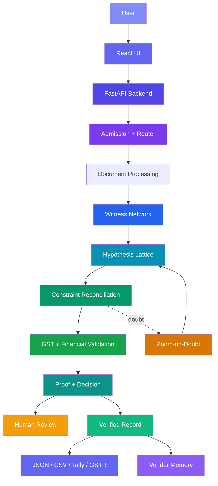
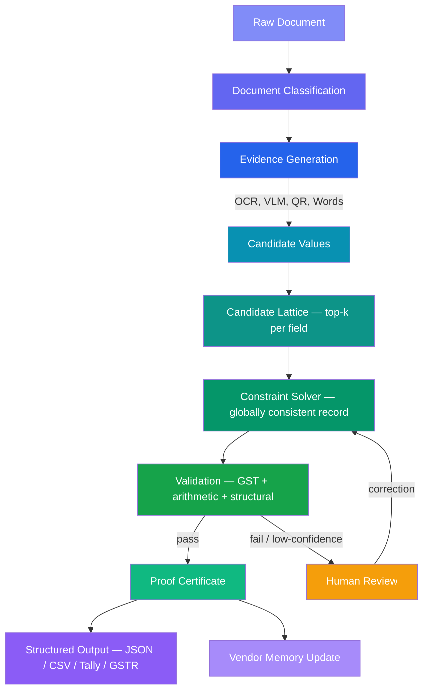
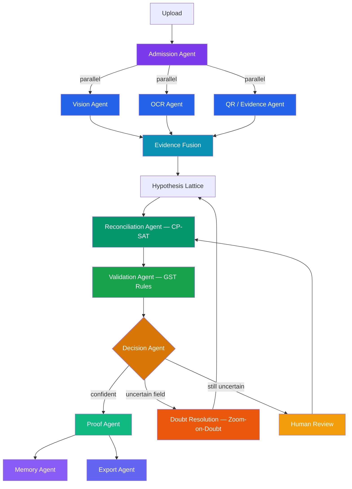
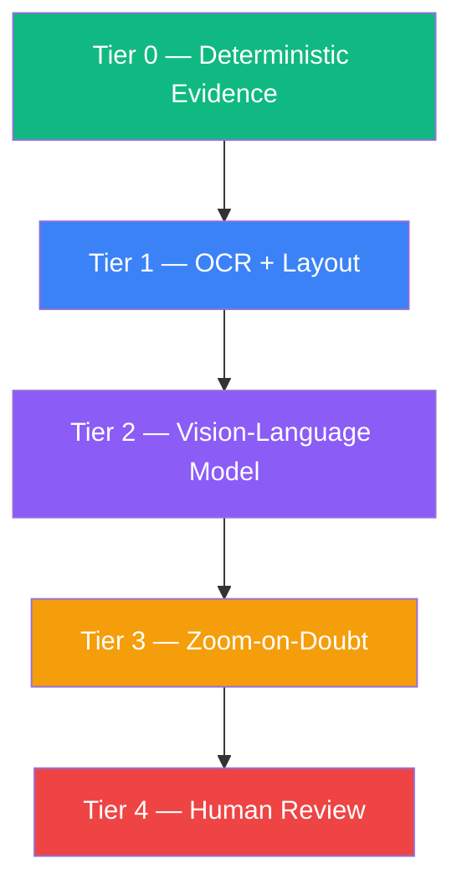

<div align="center">

<!-- HERO IMAGE -->

# VYOM+

### Proof-Carrying GST Invoice Intelligence

> *OCR guesses. VYOM+ proves.*

VYOM+ converts messy GST invoices — handwritten, printed, and digital — into **validated, explainable, and machine-readable financial records**. Every output carries proof of how it was derived, why it is trusted, and what evidence supports it.

<br/>


<br/>

<p>
  
</p>

</div>

---

<!-- ═══════════════════════════════════════════════════════════════
     TABLE OF CONTENTS
     ═══════════════════════════════════════════════════════════════ -->

<details>
<summary><strong>📑 Table of Contents</strong></summary>

**Mandatory Sections**

1. [Project Name](#1--project-name)
2. [Problem Statement](#2--problem-statement)
3. [Project Overview](#3--project-overview)
4. [Proposed Solution](#4--proposed-solution)
5. [Objectives](#5--objectives)
6. [Target Users / Use Case](#6--target-users--use-case)
7. [Open-Source AI Technology Selected](#7--open-source-ai-technology-selected)
8. [Why This Technology Was Selected](#8--why-this-technology-was-selected)
9. [AI's Role in the System](#9--ais-role-in-the-system)
10. [System Architecture](#10--system-architecture)
11. [Component-Level Architecture](#11--component-level-architecture)
12. [Data / Information Flow](#12--data--information-flow)
13. [Agentic Workflow](#13--agentic-workflow)
14. [Technology Stack](#14--technology-stack)
15. [Expected Features](#15--expected-features)
16. [Implementation Approach](#16--implementation-approach)
17. [Expected Final Output](#17--expected-final-output)
18. [Future Scope / Scalability](#18--future-scope--scalability)
19. [Open-Source Dependencies / Components](#19--open-source-dependencies--components)
20. [Expected Challenges and Mitigation](#20--expected-challenges-and-mitigation)

**Supplementary Sections**

21. [Key Innovation](#21--key-innovation)
22. [Why VYOM+ Is Different](#22--why-vyom-is-different)
23. [Proof-Carrying Output](#23--proof-carrying-output)
24. [Processing Tiers](#24--processing-tiers)
25. [Example: Handwritten Invoice Repair](#25--example-handwritten-invoice-repair)
26. [Example: Tampered Invoice Detection](#26--example-tampered-invoice-detection)
27. [Canonical Schema](#27--canonical-schema)
28. [Demo Flow](#28--demo-flow)
29. [Evaluation Strategy](#29--evaluation-strategy)
30. [Project Roadmap](#30--project-roadmap)
31. [Contributing](#31--contributing)
32. [License](#32--license)

</details>

---

<!-- ═══════════════════════════════════════════════════════════════
     SECTION 1 — PROJECT NAME
     ═══════════════════════════════════════════════════════════════ -->

## 1 · Project Name

**VYOM+** — *Proof-Carrying GST Invoice Intelligence*

An end-to-end multimodal document intelligence platform that accepts **Excel, CSV, PDF, JPEG, and PNG** invoices and converts them into validated, proof-carrying financial records. VYOM+ combines OCR, vision-language models, constraint solving, and deterministic GST rules so that every extracted value is backed by evidence — not just a model's best guess.

---

<!-- ═══════════════════════════════════════════════════════════════
     SECTION 2 — PROBLEM STATEMENT
     ═══════════════════════════════════════════════════════════════ -->

## 2 · Problem Statement

Indian GST invoice processing is hard because invoices are unpredictable:

| Challenge | Why It Matters |
|---|---|
| **Format diversity** | Invoices arrive as PDFs, Excel sheets, CSVs, scanned images, and phone-camera photos — no single reader works for all |
| **Template variation** | Thousands of supplier formats; no two layouts are identical |
| **Handwritten invoices** | Small-business India still runs on handwritten tax invoices — often with Devanagari digits, lakh/crore notation, stamps, and carbon copies |
| **OCR digit misreads** | A `3` read as `8` is plausible; traditional OCR cannot tell |
| **Table structure loss** | Row/column relationships break during extraction — items get misaligned |
| **Interdependent fields** | Quantities, rates, amounts, taxes, and totals form mathematical constraints; a single wrong digit cascades |
| **Plausible but wrong** | An extracted value can look reasonable yet still be incorrect |
| **Reader error vs. document error** | Simple OCR cannot distinguish its own mistake from an invoice that was genuinely wrong or tampered with |
| **Accounting trust** | Downstream systems need structured, validated, trustworthy data — not raw OCR output |

> **Reading text is not enough. The system must understand, validate, and prove the extracted financial record.**

---

<!-- ═══════════════════════════════════════════════════════════════
     SECTION 3 — PROJECT OVERVIEW
     ═══════════════════════════════════════════════════════════════ -->

## 3 · Project Overview

VYOM+ is a **full document intelligence platform**, not a simple OCR wrapper. It processes invoices through a canonical pipeline where every stage adds evidence, narrows uncertainty, and builds toward a provably correct financial record.

```
UPLOAD → ADMIT → WITNESS → LATTICE → RECONCILE → ZOOM-ON-DOUBT → PROVE + DECIDE → LEARN + EXPORT
```

| Stage | Purpose |
|---|---|
| **Upload** | Accept `.xlsx`, `.csv`, `.pdf`, `.jpeg`, `.jpg`, `.png` |
| **Admit** | Classify document type; route to the right processing pipeline |
| **Witness** | Run multiple independent extractors — OCR, VLM, QR, amount-in-words — to gather evidence |
| **Lattice** | Retain top-k candidate readings per field instead of committing early |
| **Reconcile** | Use a constraint solver to find the most probable globally consistent interpretation |
| **Zoom-on-Doubt** | Crop, enhance, and re-read ambiguous regions at higher resolution |
| **Prove + Decide** | Attach proof certificates; auto-approve high-confidence records or escalate to human review |
| **Learn + Export** | Update vendor memory from approved data; export structured records |

---

<!-- ═══════════════════════════════════════════════════════════════
     SECTION 4 — PROPOSED SOLUTION
     ═══════════════════════════════════════════════════════════════ -->

## 4 · Proposed Solution

VYOM+ addresses the invoice intelligence problem through eleven interlocking capabilities:

1. **Adaptive document routing** — classify input format and complexity; dispatch to the right pipeline tier
2. **Multi-witness extraction** — OCR, VLM, QR evidence, and amount-in-words as independent witnesses for the same values
3. **Candidate / hypothesis lattice** — retain top-k candidate readings per field rather than premature commitment
4. **Constraint-based reconciliation** — a CP-SAT / Z3 solver picks the globally consistent interpretation that satisfies financial identities
5. **GST-aware validation** — structural GSTIN validation, HSN checks, tax-rate verification, arithmetic cross-checks
6. **Handwriting-specific processing** — dedicated models and writer calibration for handwritten Indian invoices
7. **Confidence calibration** — calibrated probabilities rather than raw model scores
8. **Human-in-the-loop review** — uncertain fields go to one-tap human review, not entire re-entry
9. **Proof-carrying output** — every final value carries its evidence chain, validation results, and repair history
10. **Vendor memory** — learned supplier templates accelerate future extraction (trained only on approved/corrected data)
11. **Tamper and duplicate detection** — flag documents where embedded text layers contradict rendered content

### Why VYOM+ Is Different

| Dimension | Typical OCR + LLM | VYOM+ |
|---|---|---|
| Evidence sources | One model | Multiple independent witnesses |
| Strategy | Extract first, validate later | Reconcile *during* extraction |
| Validation | Warning-only | Validation **drives** decisions |
| Confidence | Raw model score | Calibrated probability |
| Output | Flat JSON | Proof-carrying financial record |
| Error handling | Report error | Evidence-backed repair with counterfactual |
| Processing | Same pipeline for all | Escalation ladder (Tiers 0–4) |
| Handwriting | Afterthought | First-class India-native support |

---

<!-- ═══════════════════════════════════════════════════════════════
     SECTION 5 — OBJECTIVES
     ═══════════════════════════════════════════════════════════════ -->

## 5 · Objectives

### Technical Objectives

- **Multi-format ingestion** — process Excel, CSV, PDF, JPEG/JPG, PNG without manual configuration
- **Handwritten invoice intelligence** — extract and validate handwritten GST invoices including Devanagari digits and Hindi/Marathi text
- **GST field extraction** — supplier/recipient GSTIN, invoice number, date, HSN/SAC codes, quantities, rates, CGST/SGST/IGST, totals
- **Line-item extraction** — accurate row-level item capture preserving table structure
- **Structured output** — canonical JSON, CSV, Tally XML, GSTR-style exports
- **Validation** — arithmetic, GSTIN structural, tax-rate, and cross-field consistency checks
- **Explainability** — every output value has an evidence trail and repair justification
- **Confidence scoring** — calibrated per-field confidence rather than a single document-level score

### Business Objectives

- **Human review efficiency** — surface only uncertain fields for one-tap correction
- **Accounting integration** — outputs ready for Tally, ERP, and GSTR filing
- **Scalability** — support batch processing and multi-tenant operation
- **Trust** — proof certificates enable audit trails and compliance

---

<!-- ═══════════════════════════════════════════════════════════════
     SECTION 6 — TARGET USERS / USE CASE
     ═══════════════════════════════════════════════════════════════ -->

## 6 · Target Users / Use Case

### Target Users

| Segment | Need |
|---|---|
| **SMEs & retailers** | Digitize handwritten and printed purchase/sales invoices |
| **Accountants & CA firms** | Automate data entry for GST filing and bookkeeping |
| **Finance departments** | Validate incoming vendor invoices before payment |
| **Wholesalers & procurement** | Process high-volume purchase invoices |
| **Accounting software providers** | Embed validated extraction as a service |
| **ERP systems** | Ingest structured, verified invoice data |

### Use Cases

- Invoice digitization (handwritten, printed, digital)
- Bookkeeping and data entry automation
- GST verification and compliance
- Invoice-to-purchase-order reconciliation
- Batch invoice processing
- Vendor invoice processing and validation
- Audit support with proof certificates
- Accounting system / ERP integration

---

<!-- ═══════════════════════════════════════════════════════════════
     SECTION 7 — OPEN-SOURCE AI TECHNOLOGY SELECTED
     ═══════════════════════════════════════════════════════════════ -->

## 7 · Open-Source AI Technology Selected

| Technology | Role | Category |
|---|---|---|
| **PaddleOCR** | OCR, layout analysis, table recognition | Document AI |
| **OpenCV** | Image preprocessing, deskew, enhancement, perspective correction | Computer Vision |
| **Qwen2.5-VL / Qwen3-VL** | Vision-language model for semantic invoice understanding | Multimodal AI |
| **TrOCR-class model** | Handwritten text recognition | Handwriting AI |
| **OR-Tools CP-SAT** | Constraint solving and candidate reconciliation | Reasoning |
| **Z3** | SMT-based constraint verification | Reasoning |
| **PyMuPDF** | PDF text/image extraction | Document Processing |
| **pandas** | Tabular data processing | Data |
| **openpyxl** | Excel file parsing | Data |
| **rapidfuzz** | Fuzzy string matching for vendor/field identification | Search |
| **vLLM / Ollama** | Local model inference serving | Infrastructure |

> **Note:** Model and dependency licensing must be verified against the exact version and model weights used before production deployment. Not all components share the same license.

---

<!-- ═══════════════════════════════════════════════════════════════
     SECTION 8 — WHY THIS TECHNOLOGY WAS SELECTED
     ═══════════════════════════════════════════════════════════════ -->

## 8 · Why This Technology Was Selected

<details>
<summary><strong>PaddleOCR</strong> — Document OCR + Layout</summary>

- Integrated OCR, layout analysis, and table recognition in a single ecosystem
- Strong multilingual support including Devanagari
- Active open-source community with regular improvements
- PP-Structure and PP-Table modules provide structured document understanding out of the box

</details>

<details>
<summary><strong>OpenCV</strong> — Image Preprocessing</summary>

- Industry-standard image processing: deskew, perspective correction, noise removal, adaptive thresholding
- Essential for handling phone-camera captures, faded documents, and carbon copies
- Enables the Zoom-on-Doubt crop/enhance pipeline

</details>

<details>
<summary><strong>Qwen2.5-VL / Qwen3-VL</strong> — Vision-Language Model</summary>

- Semantic visual understanding of document layouts that go beyond character-level OCR
- Handles ambiguous, low-quality, and unconventional invoice formats
- Supports structured output generation with reasoning
- Can be served locally via vLLM or Ollama — no external API dependency

</details>

<details>
<summary><strong>OR-Tools CP-SAT / Z3</strong> — Constraint Solving</summary>

- **Deterministic** reconciliation — the constraint solver, not the LLM, is the final arbiter of financial consistency
- Finds the globally optimal interpretation across interdependent fields
- Prevents the system from trusting model hallucinations on financial values

</details>

<details>
<summary><strong>FastAPI</strong> — Backend</summary>

- Async-native Python API framework — ideal for concurrent document processing
- Native Pydantic integration for strict request/response validation
- Direct compatibility with the Python AI ecosystem (PyTorch, PaddlePaddle, etc.)

</details>

<details>
<summary><strong>React + Vite</strong> — Frontend</summary>

- Component-based architecture for the evidence-centric evaluator interface
- Fast development iteration with Vite
- Canvas overlays for bounding-box visualization and confidence heatmaps

</details>

<details>
<summary><strong>PostgreSQL</strong> — Database</summary>

- Relational storage for structured financial records, proof metadata, and audit trails
- JSONB support for flexible evidence and repair history storage
- Vendor memory and template storage

</details>

---

<!-- ═══════════════════════════════════════════════════════════════
     SECTION 9 — AI'S ROLE IN THE SYSTEM
     ═══════════════════════════════════════════════════════════════ -->

## 9 · AI's Role in the System

VYOM+ draws a clear boundary between what AI does and what deterministic logic does.

| AI Responsibilities | Deterministic Responsibilities |
|---|---|
| Visual document understanding | GSTIN structural validation (checksum, format) |
| OCR text extraction | Arithmetic verification (qty × rate = amount) |
| Handwriting interpretation | Tax calculation checks (taxable × rate = tax) |
| Layout and table understanding | Cross-field consistency (line sum = subtotal) |
| Candidate value generation | Constraint solving (CP-SAT / Z3) |
| Semantic field extraction | Decision gates (approve / review / reject) |
| Ambiguity resolution | Duplicate detection logic |
| Contextual reasoning | Proof certificate generation |
| Amount-in-words parsing | Tamper detection (text-layer vs. render comparison) |

> **LLMs/VLMs generate evidence and candidates. Deterministic rules and constraint solvers decide whether the financial record is trustworthy.**

The constraint solver acts as a **reconciliation engine**: it receives candidate values from multiple AI witnesses and selects the globally consistent interpretation that satisfies all financial identities. The LLM is never the final source of truth for financial values.

---

<!-- ═══════════════════════════════════════════════════════════════
     SECTION 10 — SYSTEM ARCHITECTURE
     ═══════════════════════════════════════════════════════════════ -->

## 10 · System Architecture




---

<!-- ═══════════════════════════════════════════════════════════════
     SECTION 11 — COMPONENT-LEVEL ARCHITECTURE
     ═══════════════════════════════════════════════════════════════ -->

## 11 · Component-Level Architecture


---

<!-- ═══════════════════════════════════════════════════════════════
     SECTION 12 — DATA / INFORMATION FLOW
     ═══════════════════════════════════════════════════════════════ -->

## 12 · Data / Information Flow



**Key data transformations:**

| Stage | Input | Output |
|---|---|---|
| Classification | Raw bytes | Document class + format metadata |
| Evidence | Preprocessed image/text | Per-field candidate lists with confidence + bounding boxes |
| Lattice | Candidate lists | Top-k ranked candidates per field |
| Reconciliation | Lattice | Single globally consistent interpretation |
| Validation | Candidate record | Validation status per field + overall |
| Proof | Validated record | Proof certificate with evidence chains |
| Export | Proven record | JSON, CSV, Tally XML, GSTR output, clean twin PDF |

---

<!-- ═══════════════════════════════════════════════════════════════
     SECTION 13 — AGENTIC WORKFLOW
     ═══════════════════════════════════════════════════════════════ -->

## 13 · Agentic Workflow

> **VYOM+ uses an agentic orchestration pattern in which specialized AI and deterministic workers cooperate under a central orchestrator.** Not every component is an autonomous LLM agent — the constraint solver, GST validator, and proof generator are deterministic services.



### Logical Agent Roles

| Agent | Type | Responsibility |
|---|---|---|
| **Admission Agent** | Deterministic + AI | Classify document; select processing pipeline |
| **Vision Agent** | AI (VLM) | Semantic document understanding for complex/ambiguous invoices |
| **OCR Agent** | AI (PaddleOCR) | Character-level text extraction with layout |
| **QR / Evidence Agent** | Deterministic + AI | Decode QR codes; parse amount-in-words |
| **Reconciliation Agent** | Deterministic (CP-SAT/Z3) | Constraint solving for global consistency |
| **Validation Agent** | Deterministic | GSTIN checks, arithmetic, tax rules |
| **Doubt Resolution** | AI + Deterministic | Zoom-on-Doubt: crop, enhance, re-read |
| **Decision Agent** | Deterministic | Approve / escalate based on calibrated confidence |
| **Human Review** | Human | Resolve remaining uncertainty via one-tap interface |
| **Proof Agent** | Deterministic | Generate proof certificates and evidence chains |
| **Memory Agent** | Deterministic | Update vendor memory from approved data only |
| **Export Agent** | Deterministic | Generate JSON, CSV, Tally XML, GSTR output |

---

<!-- ═══════════════════════════════════════════════════════════════
     SECTION 14 — TECHNOLOGY STACK
     ═══════════════════════════════════════════════════════════════ -->

## 14 · Technology Stack

<p align="center">
  
</p>

| Layer | Technology | Purpose |
|---|---|---|
| **Frontend** | React, Vite, Tailwind CSS | Evidence-centric evaluator UI with canvas overlays |
| **Backend** | Python, FastAPI, Pydantic | Async API, schema validation, job orchestration |
| **OCR** | PaddleOCR | Text extraction, layout analysis, table recognition |
| **Vision AI** | Qwen2.5-VL / Qwen3-VL | Semantic visual understanding of invoices |
| **Handwriting** | TrOCR-class model | Handwritten text recognition |
| **PDF** | PyMuPDF | PDF text/image extraction, text-layer analysis |
| **Image Processing** | OpenCV | Deskew, crop, enhance, perspective correction |
| **Reasoning** | OR-Tools CP-SAT, Z3 | Constraint solving, candidate reconciliation |
| **Database** | PostgreSQL | Financial records, proof metadata, vendor memory |
| **Tabular** | pandas, openpyxl | Excel/CSV processing, column-role discovery |
| **Fuzzy Matching** | rapidfuzz | Vendor identification, field name matching |
| **Inference** | vLLM / Ollama | Local model serving — no external API dependency |
| **Deployment** | Docker | Containerized services, optional GPU inference |

---

<!-- ═══════════════════════════════════════════════════════════════
     SECTION 15 — EXPECTED FEATURES
     ═══════════════════════════════════════════════════════════════ -->

## 15 · Expected Features

### Core Features

- Multi-format upload — `.xlsx`, `.csv`, `.pdf`, `.jpeg`, `.jpg`, `.png`
- Automatic document classification and pipeline routing
- OCR with layout and table extraction
- Structured canonical record generation
- GSTIN extraction and validation

### AI-Powered Features

- Vision-language model extraction for complex invoices
- Handwritten invoice processing (Devanagari digits, Hindi/Marathi text)
- Amount-in-words recognition and cross-validation
- Semantic field understanding and contextual reasoning
- Vendor template learning

### Reliability Features

- Multi-witness evidence gathering
- Candidate / hypothesis lattice (top-k per field)
- Constraint-based reconciliation (CP-SAT / Z3)
- GST arithmetic and structural validation
- Calibrated per-field confidence
- Proof certificate on every output

### Advanced Features *(Phase 2–3)*

- **Zoom-on-Doubt** — crop, enhance, re-read ambiguous regions
- **Vendor memory** — learn supplier layouts from approved data
- **Writer calibration** — adapt to individual handwriting styles
- **Tamper detection** — flag text-layer vs. rendered-page discrepancies
- **Duplicate detection** — catch re-submitted invoices
- **Counterfactual explanations** — explain why a repair was made and what would happen without it

### UX Features

- Evidence viewer with bounding-box overlays on the original document
- Confidence heatmap per field
- One-tap human review for uncertain fields
- Live constraint panel showing real-time validation status
- Batch upload and processing
- Structured downloads (JSON, CSV, Tally XML, GSTR)

---

<!-- ═══════════════════════════════════════════════════════════════
     SECTION 16 — IMPLEMENTATION APPROACH
     ═══════════════════════════════════════════════════════════════ -->

## 16 · Implementation Approach

Implementation follows a phased strategy that maintains a working MVP at every stage.

### Phase 1 — Core Spine

> Goal: End-to-end pipeline that can accept a document and produce a structured record.

- Document ingestion for all five formats
- Document classification and routing
- Canonical invoice schema (Pydantic)
- Excel/CSV column-role discovery (constraint-based, not header-trusting)
- PDF text extraction (PyMuPDF) + image extraction
- OCR pipeline (PaddleOCR)
- VLM pipeline (Qwen2.5-VL)
- GST field validator (GSTIN checksum, arithmetic)
- Basic React frontend — upload, view results, download JSON

### Phase 2 — Differentiators

> Goal: Multi-witness architecture and proof-carrying output.

- Hypothesis lattice with top-k candidates per field
- Witness fusion across OCR, VLM, QR, amount-in-words
- Constraint solver integration (OR-Tools CP-SAT)
- Amount-in-words parser (Hindi / English / mixed)
- QR code evidence extraction
- Zoom-on-Doubt pipeline
- Proof certificate generation
- One-tap human review interface
- Tamper detection (text-layer vs. render comparison)
- Evidence viewer with bounding-box overlays

### Phase 3 — Advanced Capabilities

> Goal: India-native intelligence and production hardening.

- Writer calibration for handwriting-heavy vendors
- Vendor memory learning from approved data
- Full Devanagari digit and Hindi/Marathi text support
- Batch processing mode
- Tally XML export
- GSTR-style structured output
- Evaluation benchmark dashboard
- Clean twin PDF generation

> This phasing ensures a demonstrable, working system from Phase 1 onward, with each phase adding defensible differentiation.

---

<!-- ═══════════════════════════════════════════════════════════════
     SECTION 17 — EXPECTED FINAL OUTPUT
     ═══════════════════════════════════════════════════════════════ -->

## 17 · Expected Final Output

<!-- VERIFIED OUTPUT IMAGE -->

### Canonical JSON Record

```json
{
  "document": {
    "id": "doc_a3f9c1",
    "class": "tax_invoice",
    "source_format": "jpeg",
    "writing": "handwritten",
    "pages": 1
  },
  "supplier": {
    "name": "ABC Traders",
    "gstin": "27ABCDE1234F1Z5",
    "address": "Shop 4, Market Yard, Pune"
  },
  "recipient": {
    "name": "XYZ Enterprises",
    "gstin": "27XYZAB5678C1D3"
  },
  "invoice": {
    "number": "INV-1042",
    "date": "2026-10-08",
    "place_of_supply": "Maharashtra"
  },
  "items": [
    {
      "description": "Copper Wire 2.5mm",
      "hsn": "7408",
      "qty": 3,
      "unit": "kg",
      "rate": 450.00,
      "amount": 1350.00
    },
    {
      "description": "Junction Box",
      "hsn": "8538",
      "qty": 2,
      "unit": "pcs",
      "rate": 300.00,
      "amount": 600.00
    }
  ],
  "summary": {
    "taxable_value": 1950.00,
    "cgst_rate": 9,
    "cgst": 175.50,
    "sgst_rate": 9,
    "sgst": 175.50,
    "total": 2301.00,
    "amount_in_words": "Two Thousand Three Hundred One Rupees Only"
  },
  "validation": {
    "status": "verified",
    "gstin_valid": true,
    "arithmetic_valid": true,
    "amount_words_match": true,
    "rules_passed": 12,
    "rules_total": 12
  },
  "confidence": {
    "overall": 0.96,
    "lowest_field": { "field": "supplier.name", "score": 0.88 }
  },
  "proof": {
    "certificate_id": "proof_x8d2a",
    "timestamp": "2026-10-08T10:30:00Z"
  }
}
```

### Output Formats

| Format | Purpose |
|---|---|
| **JSON** | Structured canonical record with proof metadata |
| **CSV** | Flat tabular export for spreadsheet workflows |
| **Tally XML** | Direct import into Tally accounting software |
| **GSTR-style dataset** | Structured data aligned with GST return formats |
| **Clean twin PDF** | Readable PDF with extracted data overlaid on the original |
| **Proof certificate** | Per-document evidence chain and validation summary |

---

<!-- ═══════════════════════════════════════════════════════════════
     SECTION 18 — FUTURE SCOPE / SCALABILITY
     ═══════════════════════════════════════════════════════════════ -->

## 18 · Future Scope / Scalability

### Document Types
- Purchase orders, receipts, credit notes, debit notes, delivery challans
- E-way bills, proforma invoices, quotations

### Language & Script
- Full multilingual support (Hindi, Marathi, Tamil, Gujarati, Bengali, and more)
- Regional script recognition beyond Devanagari

### Integrations
- ERP connectors (Tally, SAP, Zoho)
- Accounting platform APIs (QuickBooks, FreshBooks)
- GST filing integration (GSTR-1, GSTR-2B)

### Intelligence
- Fraud and anomaly detection across invoice populations
- Payment reconciliation (invoice ↔ bank statement)
- Automated bookkeeping pipelines
- Policy-based model routing (cost vs. accuracy tradeoffs)

### Infrastructure
- Cloud-native horizontal scaling
- GPU inference worker pools
- Asynchronous job queues (Celery / Redis)
- Multi-tenant architecture with data isolation
- Enterprise security (RBAC, audit logs, encryption at rest)

---

<!-- ═══════════════════════════════════════════════════════════════
     SECTION 19 — OPEN-SOURCE DEPENDENCIES / COMPONENTS
     ═══════════════════════════════════════════════════════════════ -->

## 19 · Open-Source Dependencies / Components

| Component | Purpose | License / Note |
|---|---|---|
| **PaddleOCR** | OCR, layout analysis, table recognition | Verify current license before deployment |
| **OpenCV** | Image preprocessing, enhancement | Open source (Apache 2.0) |
| **PyMuPDF** | PDF text/image extraction | Verify deployment license requirements (AGPL / commercial) |
| **Qwen2.5-VL / Qwen3-VL** | Vision-language document understanding | Verify model license for commercial use |
| **TrOCR** | Handwritten text recognition | Verify model license |
| **OR-Tools** | Constraint solving (CP-SAT) | Open source (Apache 2.0) |
| **Z3** | SMT constraint solving | Open source (MIT) |
| **pandas** | Tabular data processing | Open source (BSD) |
| **openpyxl** | Excel file parsing | Open source (MIT) |
| **rapidfuzz** | Fuzzy string matching | Open source (MIT) |
| **FastAPI** | Backend API framework | Open source (MIT) |
| **Pydantic** | Data validation and schemas | Open source (MIT) |
| **React** | Frontend UI framework | Open source (MIT) |
| **Vite** | Frontend build tool | Open source (MIT) |
| **PostgreSQL** | Relational database | Open source (PostgreSQL License) |
| **vLLM** | Model inference server | Open source (Apache 2.0) |
| **Ollama** | Local model runtime | Open source (MIT) |
| **Docker** | Containerization | Open source (Apache 2.0) |

> **⚠️ Licenses must be re-verified against the exact version and model weights used in deployment.** Some components (PyMuPDF, model weights) may have license terms that differ from their core library.

---

<!-- ═══════════════════════════════════════════════════════════════
     SECTION 20 — EXPECTED CHALLENGES AND MITIGATION
     ═══════════════════════════════════════════════════════════════ -->

## 20 · Expected Challenges and Mitigation

| # | Challenge | Mitigation |
|---|---|---|
| 1 | **Handwriting ambiguity** | Multiple witnesses (OCR + VLM + amount-in-words); constraint solver picks the consistent reading; writer calibration over time |
| 2 | **Poor image quality** | OpenCV preprocessing pipeline: deskew, denoise, adaptive threshold, perspective correction; Zoom-on-Doubt for targeted enhancement |
| 3 | **OCR digit misreads** | Hypothesis lattice retains top-k candidates; constraint reconciliation cross-checks against financial identities |
| 4 | **Complex invoice layouts** | PaddleOCR layout analysis + VLM semantic understanding; vendor memory learns known templates |
| 5 | **Table-row association** | Layout-aware extraction preserving row/column structure; constraint validation (qty × rate = amount) catches misalignments |
| 6 | **GST arithmetic inconsistencies** | Deterministic arithmetic + tax-rate checks; distinguish reader error from genuinely incorrect invoices |
| 7 | **False corrections** | Minimal-change repair principle; repair caps prevent excessive modification; every repair carries counterfactual explanation |
| 8 | **Model hallucination** | LLMs generate candidates only — constraint solver and deterministic rules make final decisions; LLM never overrides arithmetic |
| 9 | **Low-confidence fields** | Calibrated confidence scoring; uncertain fields escalate to one-tap human review rather than silent guessing |
| 10 | **Latency** | Tiered processing (Tiers 0–4); expensive AI models invoked only when simpler methods fail |
| 11 | **Privacy** | Local-first inference (vLLM / Ollama); no mandatory external API calls; data stays on-premise |
| 12 | **Rule drift** | Versioned GST rule book; rules updated independently of model weights |
| 13 | **Vendor layout variation** | Vendor memory adapts to known suppliers; constraint-based column discovery for tabular inputs (not header-dependent) |
| 14 | **Memory poisoning** | Vendor memory learns only from approved/corrected data; human-reviewed records are the training signal |
| 15 | **Model licensing** | License verification checklist before production; fallback to permissively licensed alternatives where needed |

---

<!-- ═══════════════════════════════════════════════════════════════
     SUPPLEMENTARY SECTIONS
     ═══════════════════════════════════════════════════════════════ -->

## 21 · Key Innovation

<div align="center">

### Traditional Pipeline

```
OCR  →  LLM  →  JSON
```

### VYOM+ Pipeline

```
Evidence  →  Candidates  →  Constraints  →  Reconciliation  →  Proof  →  Verified Record
```

</div>

> *"VYOM+ does not simply read invoices. It reasons over the evidence already present inside them."*

Invoice data is **over-determined**: quantities × rates = line amounts, line amounts sum to subtotals, taxable value × tax rate = tax, subtotal + taxes = total, amount-in-words independently states the total, and e-invoice QR codes carry digitally signed field values. VYOM+ exploits this redundancy — it turns every invoice into a system of constraints and finds the reading that satisfies all of them.

---

## 22 · Why VYOM+ Is Different

| What You Expect | What VYOM+ Does |
|---|---|
| One model reads everything | Multiple independent witnesses produce evidence |
| Extract first, validate later | Validation is embedded in the extraction process |
| Warnings about bad data | Validation **drives** the final value selection |
| Raw neural-net score | Calibrated, interpretable confidence |
| Flat JSON output | Proof-carrying financial record with evidence chains |
| Error messages | Evidence-backed repair with counterfactual explanation |
| Same pipeline for every document | Escalation ladder — compute spent only when needed |
| Handwriting is an afterthought | First-class support for India-native handwritten invoices |
| Trust the model | Trust the math; models propose, constraints decide |

---

## 23 · Proof-Carrying Output

Every field in the final record carries:

```json
{
  "field": "summary.total",
  "value": 2301.00,
  "confidence": 0.97,
  "source": "constraint_solver",
  "witnesses": [
    { "witness": "paddle_ocr", "value": 2301, "confidence": 0.72, "bbox": [412, 680, 510, 705] },
    { "witness": "qwen_vlm", "value": 2301, "confidence": 0.89 },
    { "witness": "amount_in_words", "value": 2301, "confidence": 0.95 },
    { "witness": "qr_code", "value": null, "note": "no QR present" }
  ],
  "validation": [
    { "rule": "line_sum_equals_subtotal", "result": "pass" },
    { "rule": "taxable_times_rate_equals_tax", "result": "pass" },
    { "rule": "subtotal_plus_tax_equals_total", "result": "pass" },
    { "rule": "amount_in_words_match", "result": "pass" }
  ],
  "repairs": [],
  "review_status": "auto_approved"
}
```

This means every value can answer: *Where did this come from? Who else agreed? What rules did it pass? Was anything changed? Can I trust it?*

---

## 24 · Processing Tiers



| Tier | What Happens | When Used |
|---|---|---|
| **Tier 0** | QR decode, PDF text-layer extraction, Excel/CSV parsing | Always — cheapest evidence first |
| **Tier 1** | PaddleOCR + layout/table analysis | Scanned and image-based documents |
| **Tier 2** | Qwen VLM semantic extraction | Ambiguous layouts, handwritten text, low-quality images |
| **Tier 3** | Crop ambiguous region → enhance → re-read at higher resolution | Fields with low confidence after Tier 2 |
| **Tier 4** | Human one-tap review | Fields still uncertain after all automated tiers |

> **Compute is spent only when necessary.** A clean digital PDF with a QR code may never reach Tier 2.

---

## 25 · Example: Handwritten Invoice Repair

<!-- HANDWRITTEN INVOICE IMAGE -->

**Scenario:** A handwritten invoice with an ambiguous digit in the line amount field.

```
OCR candidates for line amount:
  1850  (confidence: 0.46)
  1350  (confidence: 0.41)
  1750  (confidence: 0.07)
  ...others below threshold
```

**Constraint resolution:**

```
qty × rate  =  3 × 450  =  1350  ✓
line amounts sum  =  1350 + 600  =  1950  → matches subtotal  ✓
taxable × 9%  =  175.50  → matches CGST  ✓
taxable × 9%  =  175.50  → matches SGST  ✓
subtotal + taxes  =  1950 + 351  =  2301  → matches grand total  ✓
amount-in-words  =  "Two Thousand Three Hundred One"  → matches  ✓
```

**Final decision:** `1350` — consistent with all constraints.

**Repair record:**

```json
{
  "field": "items[0].amount",
  "ocr_top_candidate": 1850,
  "selected_value": 1350,
  "reason": "Constraint reconciliation: qty × rate = 1350; consistent with subtotal, taxes, total, and amount-in-words",
  "counterfactual": "If 1850 were correct, subtotal would be 2450 — inconsistent with stated total of 2301"
}
```

> The system records the repair and its evidence. It does not silently overwrite the OCR value.

---

## 26 · Example: Tampered Invoice Detection

**Scenario:** A PDF invoice where the embedded text layer disagrees with the rendered visual.

```
PDF text layer:    ₹11,800
Rendered page:     ₹12,000
```

**VYOM+ response:**

```json
{
  "field": "summary.total",
  "status": "document_inconsistent",
  "flag": "tamper_suspect",
  "text_layer_value": 11800,
  "rendered_value": 12000,
  "action": "escalate_to_review",
  "note": "Text layer and rendered content disagree. This may indicate document alteration."
}
```

> VYOM+ does **not** "correct" this automatically. A discrepancy between the text layer and the rendered page suggests the document itself may have been altered — this is flagged for human review, not silently resolved.

---

## 27 · Canonical Schema

<details>
<summary><strong>Expand: Full Canonical Invoice Schema</strong></summary>

```
InvoiceRecord
├── document
│   ├── id
│   ├── class          (tax_invoice | bill_of_supply | credit_note | ...)
│   ├── source_format  (pdf | jpeg | png | xlsx | csv)
│   ├── writing        (printed | handwritten | mixed | digital)
│   └── pages
├── supplier
│   ├── name
│   ├── gstin
│   ├── address
│   └── state_code
├── recipient
│   ├── name
│   ├── gstin
│   ├── address
│   └── state_code
├── invoice
│   ├── number
│   ├── date
│   ├── due_date
│   └── place_of_supply
├── items[]
│   ├── description
│   ├── hsn_sac
│   ├── qty
│   ├── unit
│   ├── rate
│   ├── discount
│   └── amount
├── summary
│   ├── taxable_value
│   ├── cgst / sgst / igst / cess
│   ├── total
│   ├── amount_in_words
│   └── round_off
├── validation
│   ├── status
│   ├── rules_passed
│   └── rule_results[]
├── confidence
│   ├── overall
│   └── per_field[]
├── repairs[]
│   ├── field
│   ├── original
│   ├── corrected
│   ├── reason
│   └── counterfactual
└── proof
    ├── certificate_id
    ├── witnesses[]
    └── timestamp
```

</details>

---

## 28 · Demo Flow

<!-- EVIDENCE WORKSPACE IMAGE -->

### 5-Step Demo

| Step | Action | What the User Sees |
|---|---|---|
| **1** | Upload invoice (handwritten JPEG, printed PDF, or Excel) | Document preview with format detection |
| **2** | Automatic classification | Document class badge (Tax Invoice, Bill of Supply, etc.) |
| **3** | Multi-witness extraction | Evidence viewer: bounding boxes on original, candidate values, witness sources |
| **4** | Constraint resolution | Live constraint panel: green checks, amber warnings; Zoom-on-Doubt for ambiguous fields |
| **5** | Verified output | Structured record with proof certificate; one-tap review for any remaining uncertainty |

### Interactive Demo Modes

- **Break-It Mode** — upload deliberately difficult documents (faded, rotated, handwritten, tampered) to stress-test the pipeline
- **Live Constraint Reaction** — modify a candidate value and watch the constraint panel update in real time
- **Evidence Highlighting** — hover over any extracted field to see its source witnesses and bounding boxes on the original document
- **One-Tap Correction** — tap an uncertain field to see ranked candidates; select the correct one with a single tap

---

## 29 · Evaluation Strategy

### Metrics *(to be measured)*

| Metric | Description |
|---|---|
| Field-level exact match | Per-field accuracy across all invoice fields |
| Money-field accuracy | Exact match on all monetary values |
| GSTIN accuracy | Correct GSTIN extraction rate |
| Character error rate (CER) | Character-level error rate for OCR |
| Financial correctness rate | Invoices where all financial identities hold |
| Auto-approve precision | Fraction of auto-approved invoices that are correct |
| Auto-approve coverage | Fraction of invoices that can be auto-approved |
| Review taps per invoice | Average human interactions needed per invoice |
| Calibration error (ECE) | How well confidence scores match actual accuracy |
| Latency by tier | Processing time at each escalation tier |
| Tamper detection recall | Fraction of tampered documents correctly flagged |
| Tamper false-positive rate | Fraction of clean documents incorrectly flagged |

### Benchmark Strategy

| Benchmark Set | Source | Purpose |
|---|---|---|
| Synthetic invoices | Generated with controlled layouts, fonts, degradations | Volume testing; known ground truth |
| Printed / e-invoice PDFs | Real anonymized documents | Real-world template variation |
| Handwritten invoices | Hand-collected samples | Handwriting intelligence evaluation |
| Degraded documents | Synthetic noise, blur, rotation, fading applied to clean invoices | Robustness testing |

> **All benchmark numbers are to be measured.** No pre-claimed accuracy figures.

---

## 30 · Project Roadmap

| Phase | Focus | Status |
|---|---|---|
| **Phase 1** | Core spine: ingestion → OCR → VLM → GST validation → basic UI | 🔨 In Progress |
| **Phase 2** | Differentiators: lattice, witnesses, constraint solver, proof, Zoom-on-Doubt, tamper detection | 📋 Planned |
| **Phase 3** | Advanced: vendor memory, writer calibration, Devanagari, batch mode, Tally/GSTR export | 📋 Planned |
| **Future** | ERP integrations, multilingual expansion, fraud detection, cloud-native scaling | 🔭 Stretch |

---

## 31 · Contributing

Contributions are welcome. If you'd like to contribute:

1. Fork the repository
2. Create a feature branch (`git checkout -b feature/your-feature`)
3. Commit your changes (`git commit -m 'Add your-feature'`)
4. Push to the branch (`git push origin feature/your-feature`)
5. Open a Pull Request

Please open an issue first for major changes to discuss the approach.

---

## 32 · License

> License information has not been specified for this project. Please check the repository for an explicit `LICENSE` file before using any component in production.
